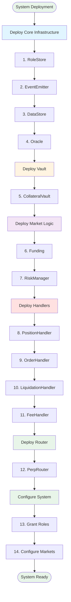

# Architecture

## System Overview

The Private Perpetual DEX is a **modular, privacy-enabled perpetual futures trading platform** built on Ztarknet (Starknet testnet). The system uses **Zero-Knowledge proofs** to keep position details private while maintaining on-chain verification.

## Core Design Principles

1. **Modular Architecture**: Each component has a single responsibility
2. **Privacy-First**: Position details hidden via ZK proofs, only commitments on-chain
3. **Centralized Data**: All state stored in `DataStore` for gas efficiency
4. **Role-Based Access**: `RoleStore` controls who can do what
5. **Event-Driven**: `EventEmitter` for off-chain indexing
6. **Oracle Integration**: Pragma Oracle for price feeds
7. **Vault-Based**: `CollateralVault` holds all tokens and manages profit/loss

## System Architecture Flow

## Component Interaction Flow

## Data Flow Architecture

## Layer Architecture

## Key Architectural Decisions

### 1. Centralized DataStore
- **Why**: Gas efficiency, single storage contract
- **Benefit**: Consistent state, easy querying
- **Trade-off**: Single point of access control

### 2. Vault-Based Token Management
- **Why**: Security, centralized profit/loss distribution
- **Benefit**: Easy fee accrual, loss absorption
- **Trade-off**: Requires trust in vault contract

### 3. Router Pattern
- **Why**: Single entry point for users
- **Benefit**: Easier integration, middleware support
- **Trade-off**: Additional contract layer

### 4. Role-Based Access Control
- **Why**: Fine-grained permissions
- **Benefit**: Security, flexibility
- **Trade-off**: Requires role management

### 5. ZK Proof Privacy
- **Why**: Hide position details from public
- **Benefit**: Privacy-preserving trading
- **Trade-off**: Off-chain proof generation overhead

## System Initialization Flow

## Operational Flow

## Summary

This architecture provides:
- ✅ **Privacy**: ZK proofs hide position details
- ✅ **Security**: Role-based access, vault for tokens
- ✅ **Efficiency**: Centralized storage, minimal on-chain data
- ✅ **Flexibility**: Modular design, easy to extend
- ✅ **Reliability**: Risk management, liquidation, fees
- ✅ **Usability**: Single router entry point

All components work together seamlessly through well-defined interfaces and clear responsibilities.

