# Private Logic

## Overview

The Private Logic layer consists of Zero-Knowledge (ZK) circuits written in Noir that validate trading operations while keeping position details private. All financial information (position size, direction, margin, PnL) is hidden from public view, with only commitment hashes stored on-chain.

## Privacy Model

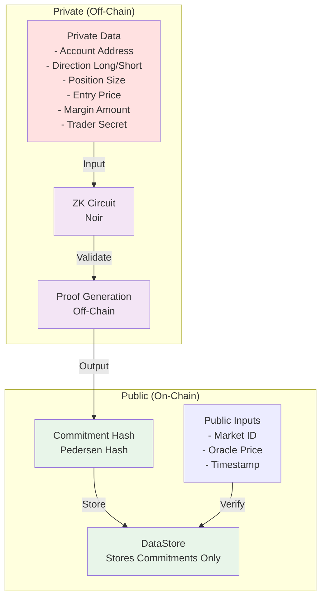

## Circuit Architecture

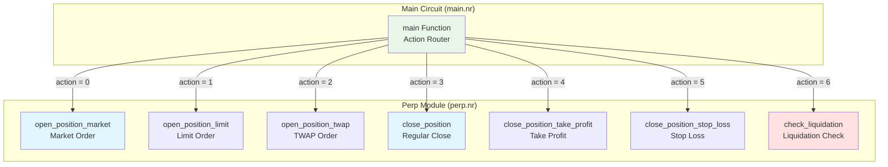

## Circuit Flow

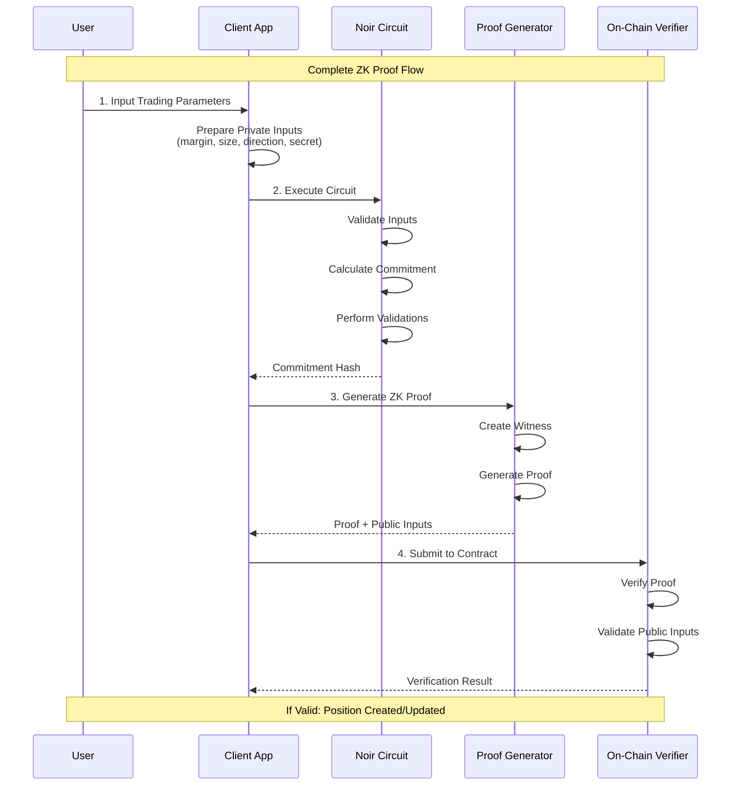

## Action Types

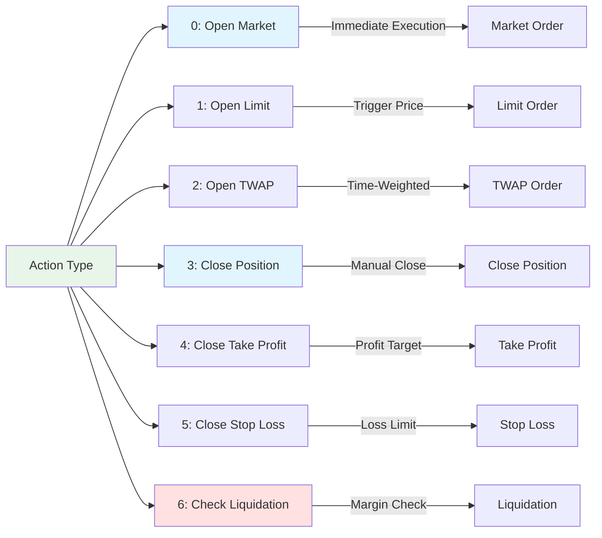

## Open Position Flow

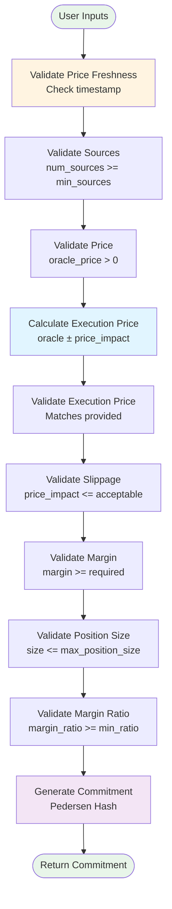

### Open Position (Market Order)

**Private Inputs**:
- `private_margin`: Collateral amount
- `private_position_size`: Position size
- `private_trader_secret`: Unique secret for commitment
- `is_long`: Direction (1 = long, 0 = short)

**Public Inputs**:
- `market_id`: Market identifier
- `oracle_price`: Current oracle price
- `execution_price`: Calculated execution price
- `price_impact`: Price impact amount
- `acceptable_slippage`: Max slippage (BPS)
- `leverage`: Leverage multiplier
- `min_margin_ratio`: Minimum margin ratio (BPS)
- `max_position_size`: Maximum position size
- `current_time`: Block timestamp
- `price_timestamp`: Price timestamp
- `num_sources`: Number of price sources
- `min_sources`: Minimum required sources
- `max_price_age`: Maximum price age (seconds)

**Validations**:
1. Price freshness: `current_time - price_timestamp <= max_price_age`
2. Sufficient sources: `num_sources >= min_sources`
3. Execution price: `execution_price = oracle_price ± price_impact`
4. Slippage: `(price_impact * 10000) / oracle_price <= acceptable_slippage`
5. Margin: `private_margin >= (private_position_size * 100) / leverage`
6. Position size: `private_position_size <= max_position_size`
7. Margin ratio: `(private_margin * 100) / private_position_size >= min_margin_ratio`

**Output**: Commitment hash (Pedersen hash of private data)

## Close Position Flow

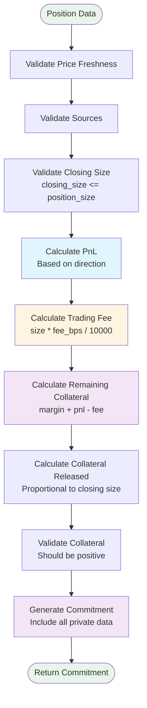

### Close Position

**Private Inputs**:
- `private_margin`: Original margin
- `private_position_size`: Full position size
- `private_entry_price`: Entry price
- `private_trader_secret`: Trader secret
- `is_long`: Direction

**Public Inputs**:
- `market_id`: Market identifier
- `current_price`: Current oracle price
- `closing_size`: Amount to close (partial close support)
- `trading_fee_bps`: Trading fee in basis points
- `current_time`: Block timestamp
- `price_timestamp`: Price timestamp
- `num_sources`: Number of price sources
- `min_sources`: Minimum required sources
- `max_price_age`: Maximum price age

**Calculations**:

1. **PnL Calculation**:
   ```noir
   // Long position
   if is_long == 1 {
       pnl = (current_price - entry_price) * closing_size / entry_price
   }
   // Short position
   else {
       pnl = (entry_price - current_price) * closing_size / entry_price
   }
   ```

2. **Trading Fee**:
   ```noir
   trading_fee = (closing_size * trading_fee_bps) / 10000
   ```

3. **Remaining Collateral**:
   ```noir
   remaining_collateral = private_margin + pnl - trading_fee
   ```

4. **Collateral Released**:
   ```noir
   if closing_size == private_position_size {
       collateral_released = remaining_collateral  // Full close
   } else {
       collateral_released = (remaining_collateral * closing_size) / private_position_size  // Partial close
   }
   ```

**Output**: Commitment hash

## Liquidation Check Flow

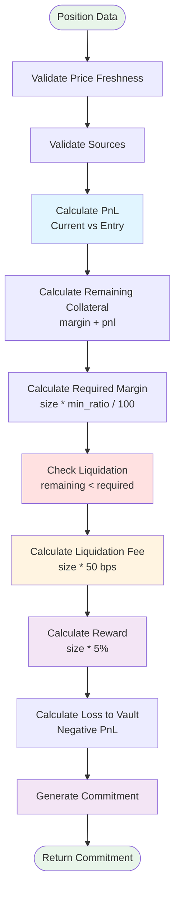

### Check Liquidation

**Private Inputs**:
- `private_margin`: Original margin
- `private_position_size`: Position size
- `private_entry_price`: Entry price
- `private_trader_secret`: Trader secret
- `is_long`: Direction

**Public Inputs**:
- `market_id`: Market identifier
- `current_price`: Current oracle price
- `min_margin_ratio`: Minimum margin ratio (BPS)
- `current_time`: Block timestamp
- `price_timestamp`: Price timestamp
- `num_sources`: Number of price sources
- `min_sources`: Minimum required sources
- `max_price_age`: Maximum price age

**Calculations**:

1. **PnL Calculation**: Same as close position
2. **Remaining Collateral**: `private_margin + pnl`
3. **Required Margin**: `(private_position_size * min_margin_ratio) / 100`
4. **Liquidation Check**: `remaining_collateral < required_margin`
5. **Liquidation Fee**: `(closed_size * 50) / 10000` (0.5%)
6. **Liquidator Reward**: `(closed_size * 500) / 10000` (5%)

**Output**: Commitment hash (validates liquidation eligibility)

## Commitment Generation

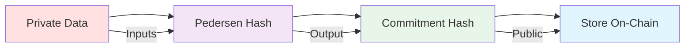

### Commitment Hash Components

For **Open Position**:
```noir
commitment = pedersen_hash([
    private_margin,
    private_position_size,
    private_trader_secret,
    market_id,
    execution_price,
    is_long
])
```

For **Close Position**:
```noir
commitment = pedersen_hash([
    private_margin,
    private_position_size,
    private_entry_price,
    private_trader_secret,
    market_id,
    current_price,
    closing_size,
    pnl,
    is_long
])
```

For **Liquidation**:
```noir
commitment = pedersen_hash([
    private_margin,
    private_position_size,
    private_entry_price,
    private_trader_secret,
    market_id,
    current_price,
    remaining_collateral,
    required_margin,
    is_long
])
```

## Privacy Guarantees

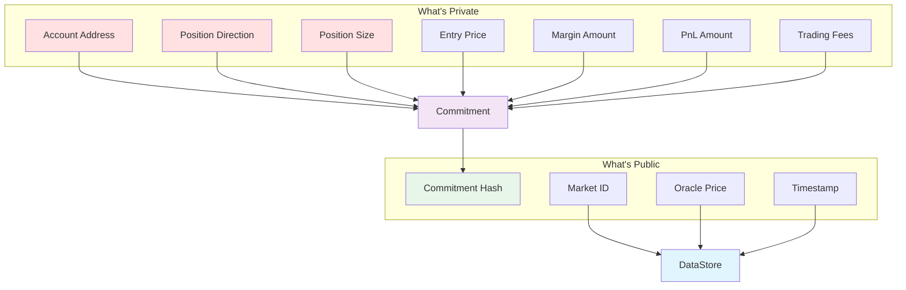

## Proof Verification Flow

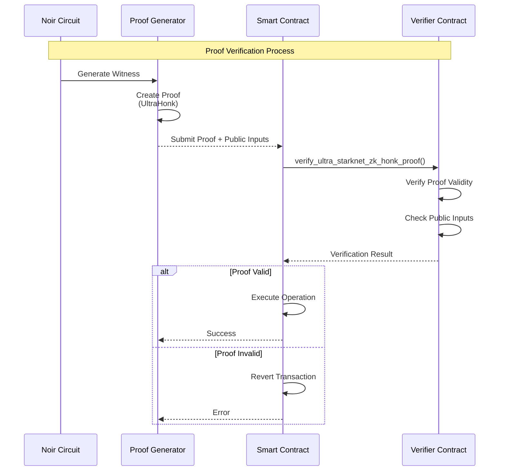

## Special Order Types

### Limit Order

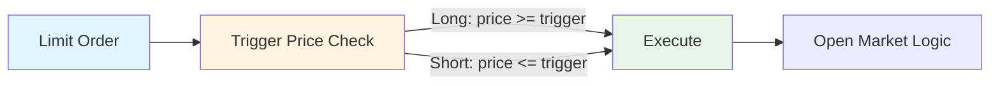

**Additional Validation**:
- For long: `oracle_price <= trigger_price` (buy when price drops)
- For short: `oracle_price >= trigger_price` (sell when price rises)

### TWAP Order

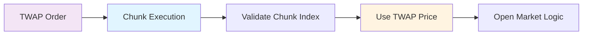

**Additional Validations**:
- TWAP duration: 5 minutes to 24 hours
- Chunk index: `chunk_index < total_chunks`
- Uses TWAP price instead of spot price

### Take Profit / Stop Loss

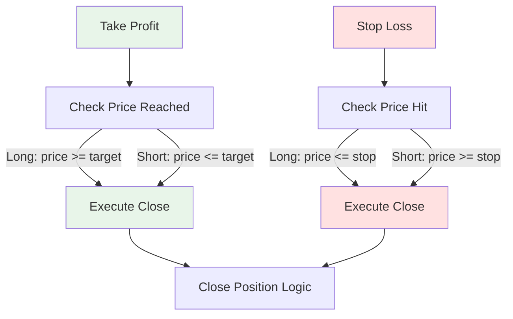

## Summary

The Private Logic layer provides:
- ✅ **Privacy**: All position details hidden via ZK proofs
- ✅ **Security**: Cryptographic validation of all operations
- ✅ **Flexibility**: Support for multiple order types
- ✅ **Efficiency**: Minimal on-chain data (only commitments)
- ✅ **Verifiability**: On-chain proof verification

The circuit ensures that:
- Position details remain private
- All validations are cryptographically proven
- Only commitment hashes are stored on-chain
- Users maintain full privacy while trading


