# Smart Contract

## Overview

The Smart Contract layer consists of modular Cairo contracts deployed on Ztarknet (Starknet testnet). The architecture follows a layered approach with clear separation of concerns, enabling privacy-preserving perpetual futures trading.

## Contract Architecture

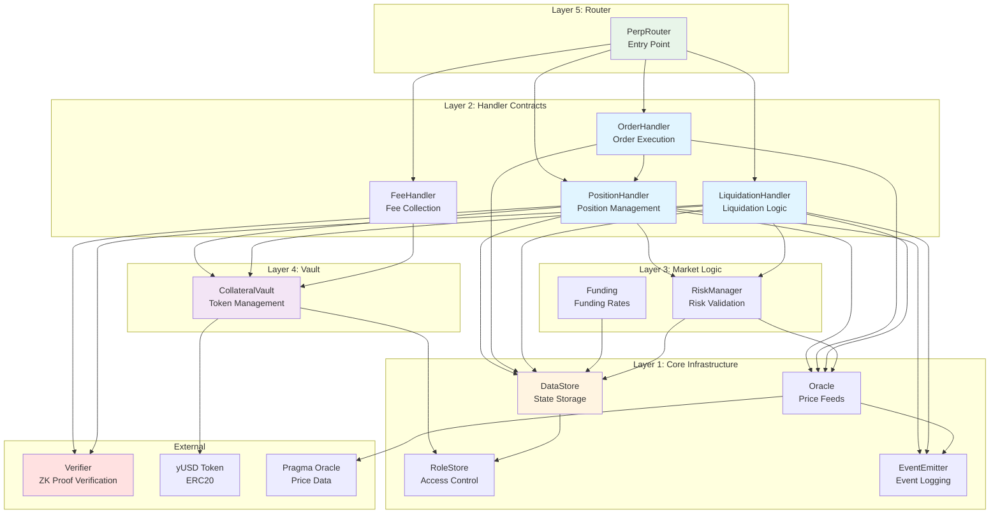

## Contract Interaction Flow

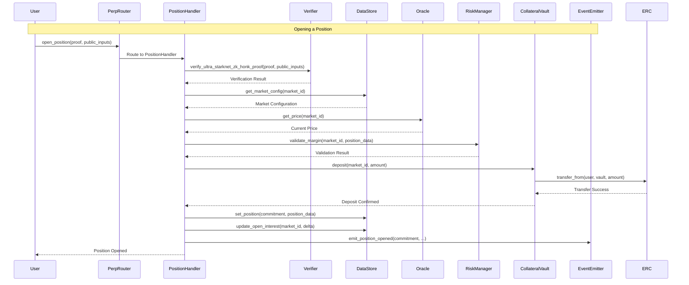

## Core Contracts

### 1. RoleStore

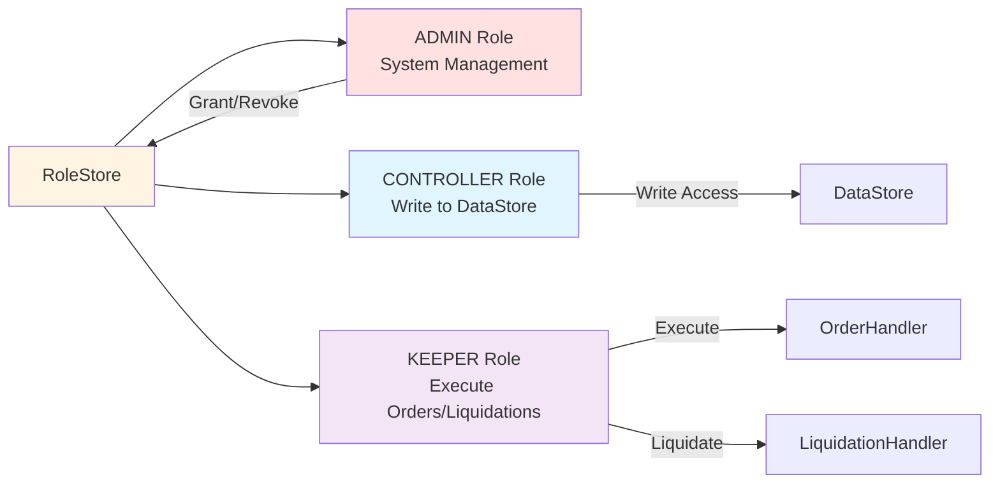

**Purpose**: Role-based access control (RBAC)

**Key Functions**:
- `grant_role(account, role)`: Grant role to account
- `revoke_role(account, role)`: Revoke role from account
- `has_role(account, role)`: Check if account has role
- `assert_only_role(account, role)`: Assert account has role (reverts if not)

**Roles**:
- `ADMIN`: System administration, role management
- `CONTROLLER`: Write access to DataStore (handlers)
- `KEEPER`: Execute limit orders and liquidations

### 2. DataStore

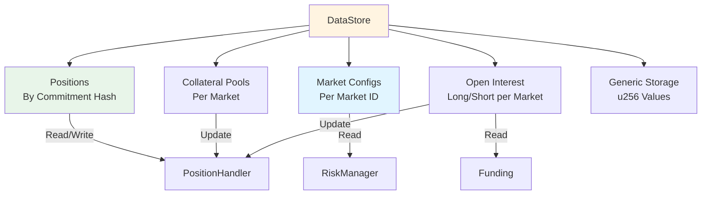

**Purpose**: Centralized state storage

**Key Functions**:
- `set_position(commitment, position)`: Store position (CONTROLLER only)
- `get_position(commitment)`: Retrieve position (public)
- `set_market_config(market_id, config)`: Configure market (ADMIN only)
- `get_market_config(market_id)`: Get market config (public)
- `update_open_interest(market_id, long_delta, short_delta)`: Update OI (CONTROLLER only)

**Access Control**:
- Reads: Public
- Writes: Only `CONTROLLER` role

### 3. Oracle

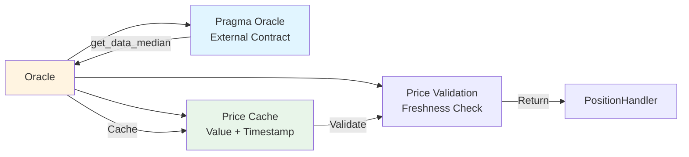

**Purpose**: Price feed integration with Pragma Oracle

**Key Functions**:
- `update_price_from_pragma(market_id)`: Fetch and cache price (KEEPER)
- `get_price(market_id)`: Get cached price (public)
- `validate_price_freshness(timestamp)`: Check price age

**Supported Markets**: BTC, ETH, WBTC, LORDS, STRK, EKUBO, DOG

**Price Structure**:
```cairo
struct Price {
    value: u128,
    timestamp: u64,
    decimals: u32,
    num_sources: u32
}
```

### 4. PositionHandler

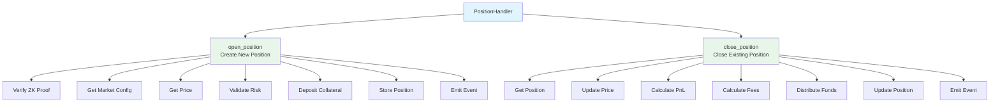

**Purpose**: Handle position opening and closing

**Key Functions**:
- `open_position(proof, public_inputs)`: Open new position
- `close_position(proof, public_inputs, commitment)`: Close position

**Dependencies**:
- `DataStore`: Read/write positions
- `Oracle`: Get prices
- `CollateralVault`: Deposit/withdraw tokens
- `EventEmitter`: Emit events
- `Verifier`: Verify ZK proofs

### 5. OrderHandler

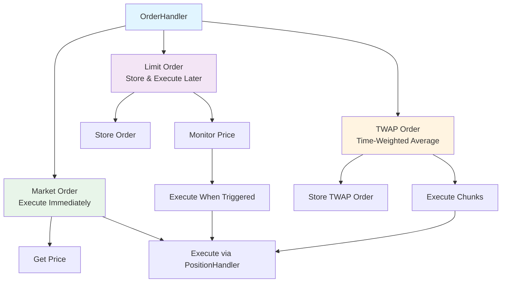

**Purpose**: Create and execute market/limit/TWAP orders

**Key Functions**:
- `create_market_order(...)`: Execute immediately
- `create_limit_order(...)`: Store for later execution
- `create_twap_order(...)`: Create TWAP order
- `execute_limit_order(...)`: Execute limit order (KEEPER)
- `execute_twap_chunk(...)`: Execute TWAP chunk (KEEPER)

### 6. LiquidationHandler

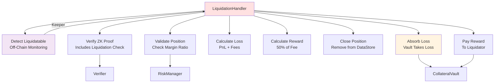

**Purpose**: Liquidate undercollateralized positions

**Key Functions**:
- `liquidate_position(proof, public_inputs, commitment)`: Liquidate position

**Liquidation Process**:
1. Verify ZK proof (includes liquidation validation)
2. Validate position is liquidatable
3. Calculate PnL and fees
4. Calculate liquidator reward (50% of liquidation fee)
5. Close position
6. Absorb loss into vault
7. Pay reward to liquidator

### 7. CollateralVault

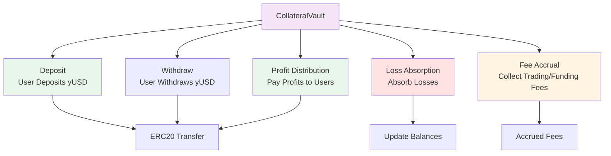

**Purpose**: Centralized token storage and profit/loss management

**Key Functions**:
- `deposit(market_id, amount)`: User deposits yUSD
- `withdraw(market_id, amount)`: User withdraws yUSD
- `withdraw_profit(market_id, recipient, amount)`: Pay profits (CONTROLLER only)
- `absorb_loss(market_id, loss_amount)`: Absorb losses (CONTROLLER only)
- `accrue_fees(market_id, fee_amount)`: Accrue fees (CONTROLLER only)

**Balance Tracking**:
- Per-user, per-market balances
- Market-level balances
- Accrued fees per market

### 8. PerpRouter

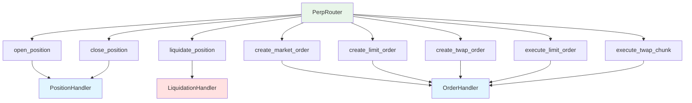

**Purpose**: Single entry point for all user operations

**Key Functions**:
- Routes all operations to appropriate handlers
- Provides unified interface for users
- Can add middleware (validation, fees) in future

## Data Structures

### Position Record

```cairo
struct PositionRecord {
    account: ContractAddress,      // User account (private in ZK)
    market_id: felt252,             // Market identifier
    commitment: felt252,            // Commitment hash (public)
    // Private fields (in ZK proof):
    // - is_long: bool
    // - size: u256
    // - margin: u256
    // - entry_price: u256
}
```

### Market Config

```cairo
struct MarketConfig {
    max_leverage: u256,
    min_margin_ratio_bps: u256,     // e.g., 500 = 5%
    max_position_size: u256,
    trading_fee_bps: u256,          // e.g., 10 = 0.1%
    liquidation_fee_bps: u256,
    is_active: bool
}
```

## Deployment Order

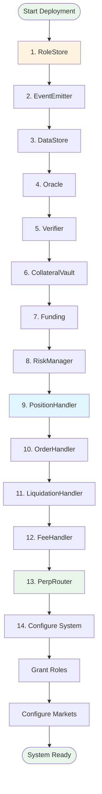

## Security Features

1. **Role-Based Access Control**: Fine-grained permissions
2. **ZK Proof Verification**: Privacy-preserving validation
3. **Price Validation**: Freshness and source checks
4. **Risk Management**: Margin and position size limits
5. **Liquidation Protection**: Automatic liquidation of risky positions

## Summary

The Smart Contract architecture provides:
- ✅ **Modularity**: Clear separation of concerns
- ✅ **Security**: Role-based access, ZK verification
- ✅ **Efficiency**: Centralized storage, minimal on-chain data
- ✅ **Privacy**: Position details hidden via commitments
- ✅ **Flexibility**: Easy to extend and upgrade

All contracts work together through well-defined interfaces, enabling a secure and efficient perpetual futures trading platform.

