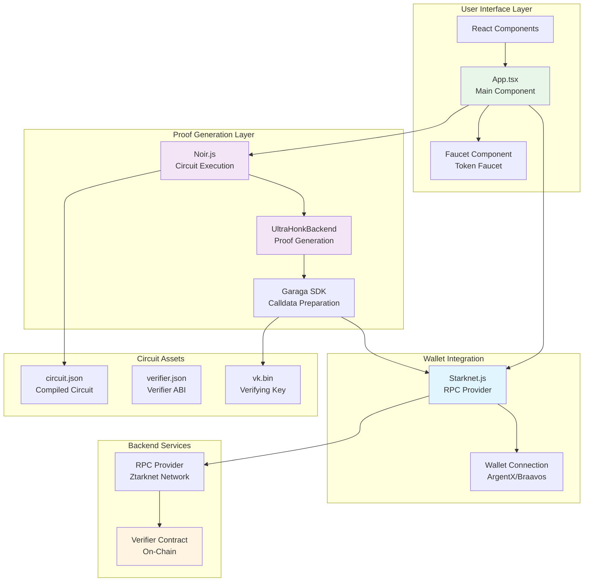
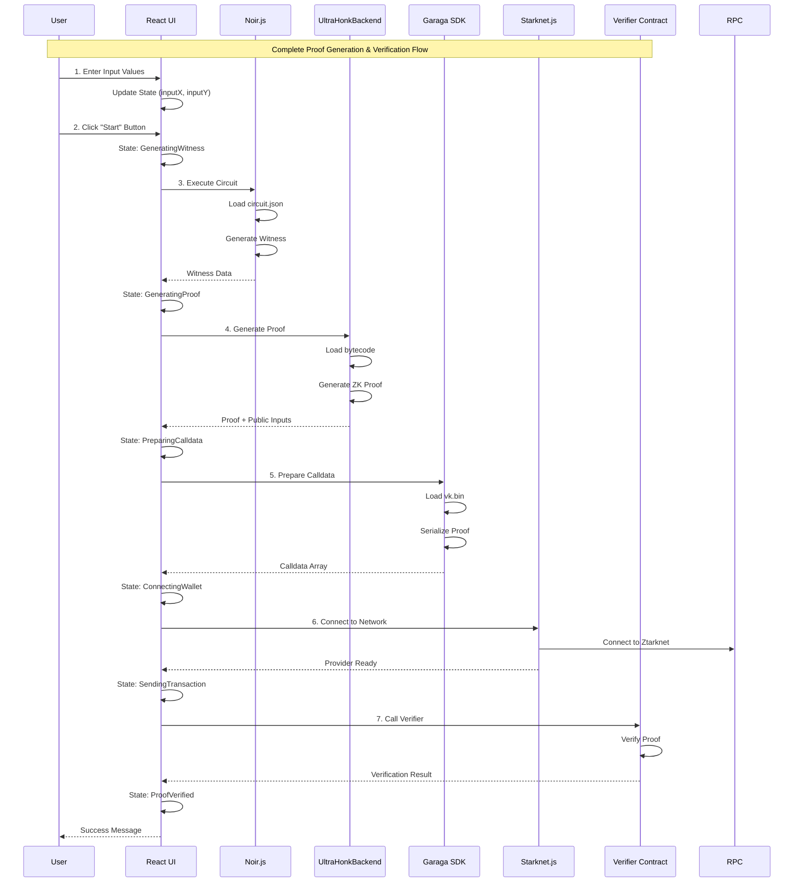
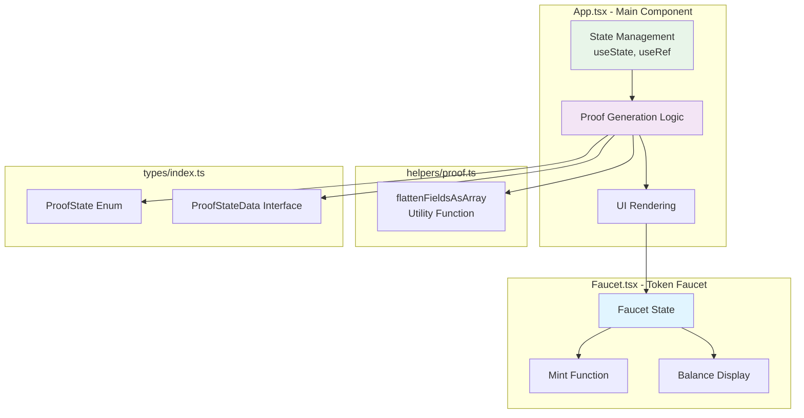
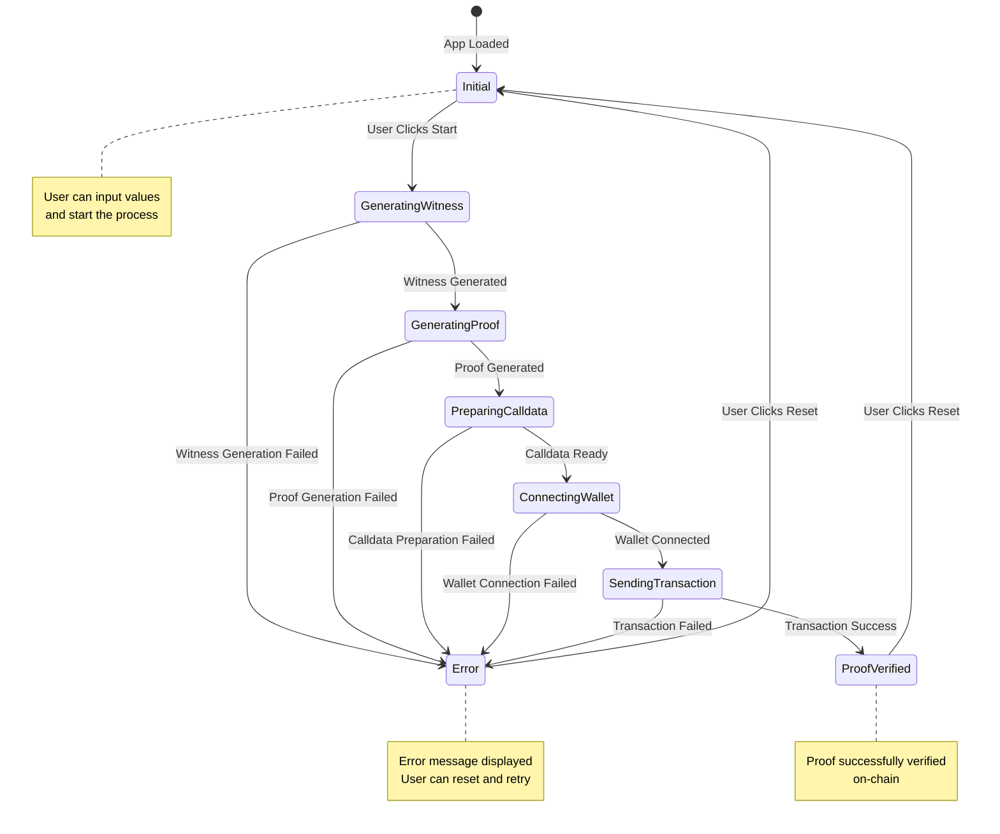
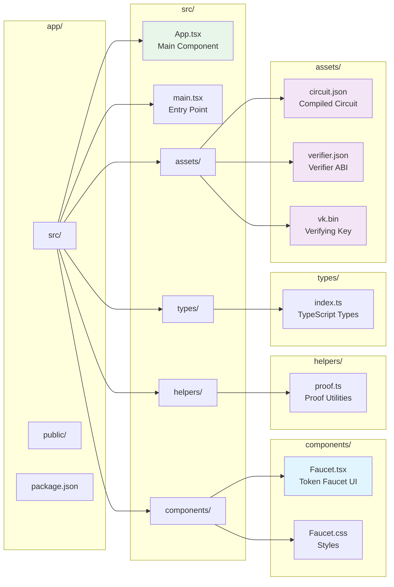
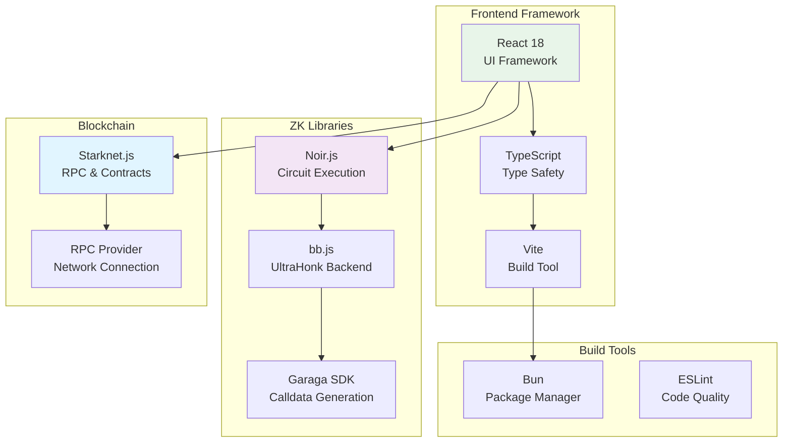
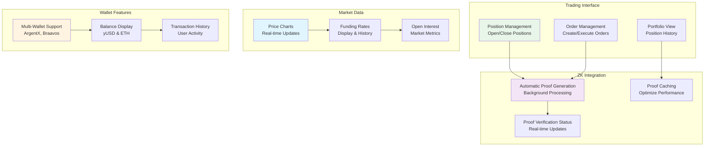
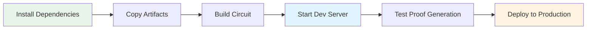
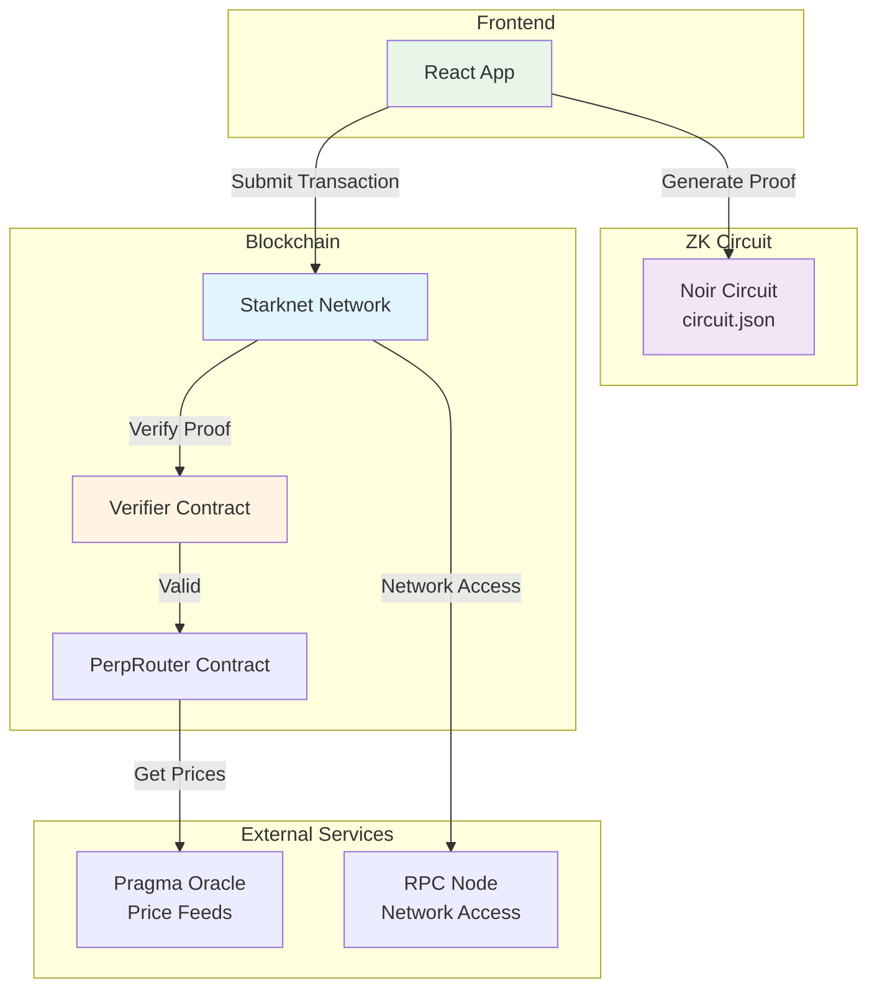

# Web App (Future Frontend Configuration)

## Overview

The Web App is a React/TypeScript frontend application that provides a user interface for interacting with the Private Perpetual DEX. It handles ZK proof generation, wallet connection, and transaction submission to the Starknet network.

## Application Architecture



## Proof Generation Flow



## Component Structure



## State Machine



## File Structure



## Technology Stack



## Key Features

### 1. Proof Generation
- **Witness Generation**: Executes Noir circuit with user inputs
- **Proof Creation**: Generates ZK proof using UltraHonk backend
- **Calldata Preparation**: Serializes proof for on-chain verification

### 2. Wallet Integration
- **Network Connection**: Connects to Ztarknet testnet
- **Contract Interaction**: Calls verifier contract methods
- **Transaction Handling**: Manages transaction lifecycle

### 3. User Interface
- **State Management**: Tracks proof generation progress
- **Error Handling**: Displays errors at each stage
- **Token Faucet**: Allows users to mint test tokens

## Future Frontend Configuration

### Planned Features



### Configuration Options

1. **Network Configuration**
   - RPC endpoint configuration
   - Contract addresses management
   - Network switching (testnet/mainnet)

2. **Proof Generation Settings**
   - Thread count for proof generation
   - Proof caching strategies
   - Background proof generation

3. **UI Customization**
   - Theme configuration
   - Layout preferences
   - Notification settings

4. **Performance Optimization**
   - Code splitting
   - Lazy loading
   - Asset optimization

## Development Setup



### Setup Steps

1. **Install Dependencies**
   ```bash
   cd app
   bun install
   ```

2. **Copy Circuit Artifacts**
   ```bash
   make artifacts
   ```

3. **Start Development Server**
   ```bash
   bun run serve
   ```

4. **Build for Production**
   ```bash
   bun run build
   ```

## Integration Points



## Summary

The Web App provides:
- ✅ **Proof Generation**: Complete ZK proof workflow
- ✅ **Wallet Integration**: Seamless blockchain interaction
- ✅ **User Experience**: Intuitive interface with state tracking
- ✅ **Error Handling**: Comprehensive error management
- ✅ **Future-Ready**: Architecture supports trading features

The frontend is designed to be extensible, allowing for easy addition of trading features, market data visualization, and advanced portfolio management tools.


